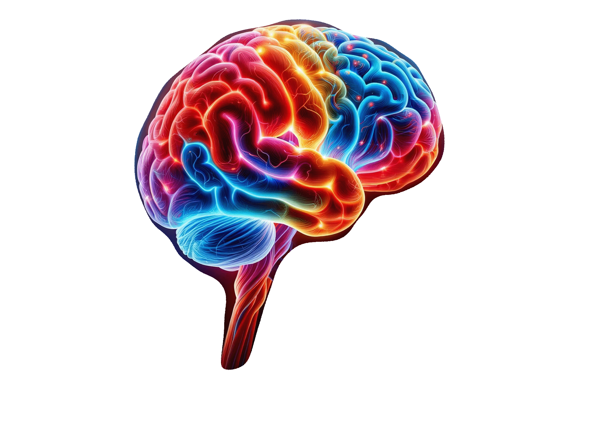

# Outcome Prediction and Consciousness Detection in Patients With Acute TBI

<div style="text-align:center">

</div>

The goal is to combine analysis of advanced diagnostic techniques such as electroencephalogram (EEG), Functional Magnetic Resonance Imaging (fMRI) analysis, and other contextual factors for consciousness detection and possible patient outcome prediction.

## Installation

**Pre-requisites:**
- GPU VRAM >= 12GB
- Python >= 3.11

## Data
Data is stored in Google Drive under [MRI-EEG-March2023](https://drive.google.com/drive/folders/1C1C8DWrzJPSuM1UR35mY9J_QudK2uMzH?usp=sharing). Once downloaded, place contents in the data folder.

## Models

### EEG-MRI SVM Model

```bash
matlab run_me.m
```

### MRI Imaging Model

```bash
pip install -r requirements.txt
```
Run Python notebooks.

### Synthetic Data

```bash
pip install -r requirements.txt
```

Generate synthetic MRI data for training:

````
python3 generate_synthetic_matlab_file.py <path_to_input_file.mat> <path_to_output_directory>
````
